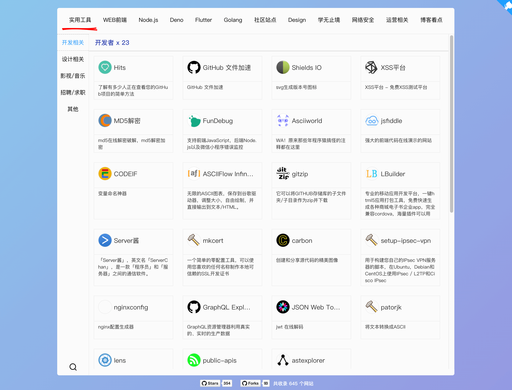

<div align="center">
  <p>发现导航 - 精选实用导航网站</p>
  <div>
    <a href="https://github.com/xjh22222228/nav/">GitHub</a>&nbsp;&nbsp;&nbsp;
    <a href="https://github.com/xjh22222228/nav/issues/">Contribution</a>&nbsp;&nbsp;&nbsp;
    <a href="https://github.com/xjh22222228/">Author</a>
  </div>
</div>


## 预览
[在线预览](https://xjh22222228.github.io/nav/index.html)





## 亮点
- [√] 三叉树分类、结构清晰、分类清晰。
- [√] 颜值与简约并存，不再是杀马特时代。
- [√] 支持中文、英文、GitHub浏览，创新。
- [√] 支持页面定位、滚动定位。
- [√] 支持移动端浏览。
- [√] 支持搜索查询。
- [√] 纯静态, 提供自动化部署。
- [√] 二次修改简单, 只需要懂一点开发知识即可。
- [√] 默认提供 `650+` 网站


## 贡献
Thank you for your [contribution](https://github.com/xjh22222228/nav/issues), men.

<a href="https://github.com/YutHelloWorld">
  
</a>
<a href="https://github.com/JJJTHuang">
  
</a>
<a href="https://github.com/Fechin">
  
</a>


## Build Setup
``` bash
# 下载
git clone --depth=1 https://github.com/xjh22222228/nav.git

# 安装依赖
npm install

# 启动[可选]
npm start

# 打包
npm run build
```


## 如何部署？
傻瓜化部署，不需要服务器, 像数 321 一样简单。

1、Fork 当前项目。

2、[https://github.com/settings/tokens](https://github.com/settings/tokens) 申请 token

3、到 https://github.com/你的名字/nav/settings/secrets/new  添加刚刚申请的token， name填写 `TOKEN`

4、当推送内容到仓库后会自动部署， 打开 https://你的名字.github.io/nav  即可看到。


## 配置文件
`config/index.ts`, 你可以对默认的 中文 、 英文 、 Github 进行修改。


## 关于图标
项目中有一部分是使用本地图标，但我建议你直接使用网络图片，方便管理。


## 支持开源


## License
[MIT](https://opensource.org/licenses/MIT)
